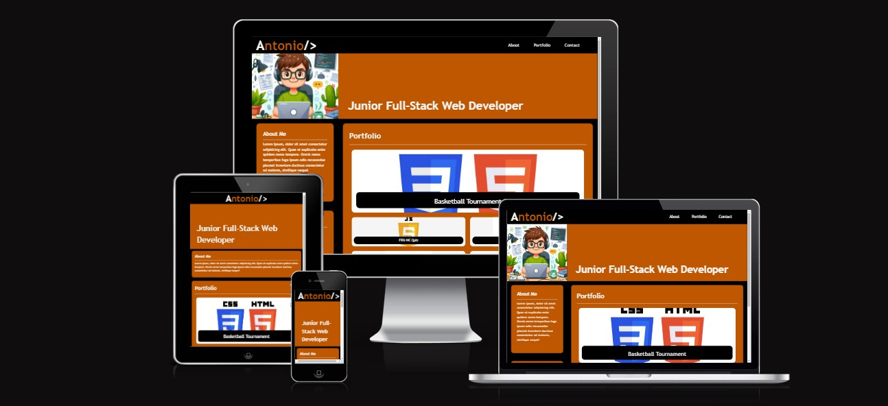
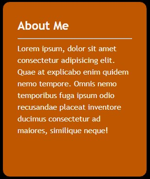
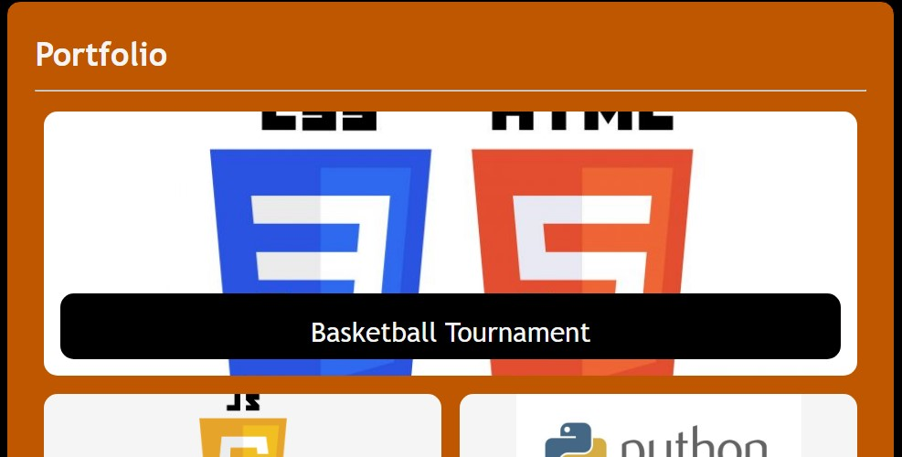
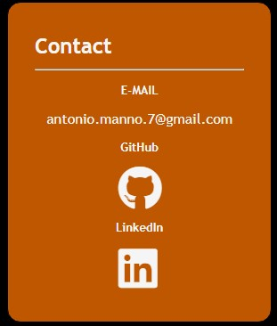

# My Portfolio Webpage

Welcome to my portfolio website! This space showcases my skills, projects, and experiences in a visually appealing and user-friendly format. Whether you're a potential employer, collaborator, or just curious about my work, this portfolio provides a glimpse into my professional journey.

The live site can be found [here.](https://totes7.github.io/my-portfolio-webpage/)

Below is a mock-up of the final product.

## Features

### Navbar

* The website is easy to navigate thanks to the navbar at the top of the page.

### Hero Banner

* This section contains an image and a banner containing my work title.

### About Me

* This section contains a brief intro about myself and my development.

### Portfolio

* This is the main section of the page, where you can find cards with links for all my project so far.

### Contact

* Here you can find my email address and links to my GitHub and LinkedIn accounts.

### Footer

* The footer is pretty basic at this point, it's definitely to improve in future versions.

## Deployment

* The site was deployed to GitHub Pages. The steps required are as follows:
    * From the GitHub main repository, navigate to Settings page.
    * Locate the Pages section.
    * Here, select Main Branch from the drop-down menu.
    * Once selected, GitHub will generate a link to the complete website.

## Technologies Used

### Languages Used

* [HTML5](https://en.wikipedia.org/wiki/HTML5)
* [CSS3](https://en.wikipedia.org/wiki/CSS)
* [Markdown](https://en.wikipedia.org/wiki/Markdown)

## Media

* The avatar was created using bing ai.
* The portfolio cards images were found on google.
* The icons are from [FontAwsome.](https://fontawesome.com/icons)

## Credits

The starter code was provided by the Bootcamp Spot instructor team.

## License

N/A
